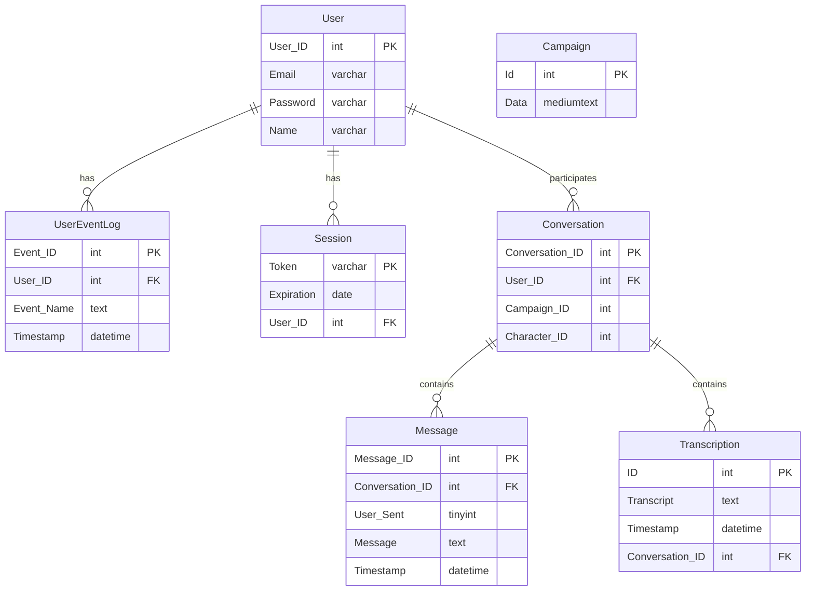

# Database Entity Relationship Diagram

```mermaid
erDiagram
    User {
        User_ID int PK
        Email varchar
        Password varchar
        Name varchar
    }
    UserEventLog {
        Event_ID int PK
        User_ID int FK
        Event_Name text
        Timestamp datetime
    }
    Session {
        Token varchar PK
        Expiration date
        User_ID int FK
    }
    Conversation {
        Conversation_ID int PK
        User_ID int FK
        Campaign_ID int
        Character_ID int
    }
    Message {
        Message_ID int PK
        Conversation_ID int FK
        User_Sent tinyint
        Message text
        Timestamp datetime
    }
    Transcription {
        ID int PK
        Transcript text
        Timestamp datetime
        Conversation_ID int FK
    }
    Campaign {
        Id int PK
        Data mediumtext
    }

    User ||--o{ Session : "has"
    User ||--o{ Conversation : "participates"
    User ||--o{ UserEventLog : "has"
    Conversation ||--o{ Message : "contains"
    Conversation ||--o{ Transcription : "contains"

```