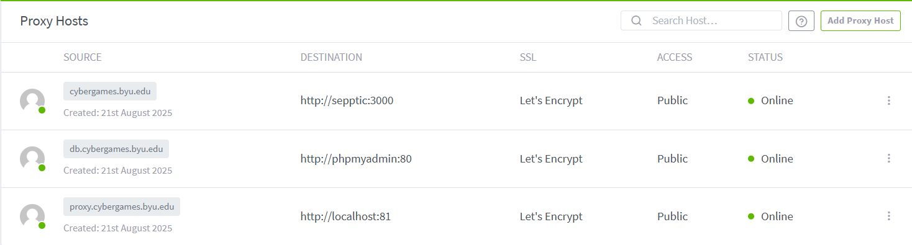

# Nginx Proxy Manager

The Nginx Proxy Manager provides developers with a simple GUI for forwarding BAIT resources to the public internet. You can set up SSL certificates, choose domains, and specifiy what port to forward in one simple menu.

An Example configuration for the proxy itself would be as follows:
```json
Domain: proxy.cybergames.byu.edu
Scheme: http
Forward Hostname: localhost
Forward Port: 81

Certificate:
proxy.cybergames.byu.edu
Force SSL: true
HTTP/2 Support: true
```
#### Hostname Conventions
The proxy will see the containers by their name inside the docker network, so the Forward hostname for a phpmyadmin container would not be 127.0.0.1, localhost, or 0.0.0.0. It would just be the name of the container, in this case, phpmyadmin

### Example docker-compose.yml
```yml
services:
  app:
    image: 'jc21/nginx-proxy-manager:latest'
    container_name: nginx-proxy-manager
    restart: unless-stopped
    ports:
      - '80:80'
      - '443:443'
      - '81:81'
    volumes:
      - ./data:/data
      - ./letsencrypt:/etc/letsencrypt
    networks:
      - sepptic_sepptic
    environment:
      INITIAL_ADMIN_EMAIL: "bait@gmail.com"
      INITIAL_ADMIN_PASSWORD: <password> # These set the default account credentials; They can be changed anytime
networks:
  sepptic_sepptic:
    external: true
```

### Dashboard Example

