```mermaid

classDiagram
    class API auth POST{
        email: string
        password: string
        -------------------
        token: string
        message: string
    }

    class API auth DELETE{
        Token: string
        -------------------
        message: string
    }

    class API register POST{
        name: string
        image: string
        email: string
        password: string
        -------------------
        message: string
    }

    class API profile GET{
        Token: string
        -------------------
        name: string
        image: string
        email: string
        achievements: int list
        message: string
    }

    class API profile PUT{
        Token: string
        name: string
        image: string
        email: string
        password: string
        -------------------
        message: string
    }

    class API progress GET{
        Token: string
        -------------------
        progress: json list
        message: string
    }

    class API progress POST{
        Token: string
        progress: json
        -------------------
        message: string
    }

    class API campaign GET{
        Token: string
        CampaignID: int
        -------------------
        campaign: json
        message: string
    }

    class API chat GET{
        Token: string
        ConversationId: int
        -------------------
        chat: json list
        message: string
    }

    class API chat POST{
        Token: string
        ConversationId: int
        message: string
        -------------------
        message: string
    }

    style APIauthPOST fill:#008,color:#FFF
    style APIauthDELETE fill:#008,color:#FFF
    style APIregisterPOST fill:#008,color:#FFF
    style APIprofileGET fill:#008,color:#FFF
    style APIprofilePUT fill:#008,color:#FFF
    style APIprogressGET fill:#008,color:#FFF
    style APIprogressPOST fill:#008,color:#FFF
    style APIcampaignGET fill:#008,color:#FFF
    style APIchatGET fill:#008,color:#FFF
    style APIchatPOST fill:#008,color:#FFF

    class DB createUser{
        email: string
        password: string
        name: string
        -------------------
        userId: int
        message: string
        status: int
    }

    class DB updateUser{
        userId: int
        email: string
        password: string
        name: string
        -------------------
        message: string
        status: int
    }

    class DB getUser{
        userId: int
        -------------------
        email: string
        password: string
        name: string
        message: string
        status: int
    }

    class DB createSession{
        userId: int
        -------------------
        sessionId: int
        token: string
        expiration: datetime
        message: string
        status: int
    }

    class DB deleteSession{
        sessionId: int
        token: int
        -------------------
        message: string
        status: int
    }

    class DB getSession{
        sessionId: int
        token: int
        -------------------
        userId: int
        expiration: datetime
        message: string
        status: int
    }

    class DB purgeSessions{
        -------------------
        message: string
        status: int
    }

    class DB AddIntel{
        userId: int
        campaignId: int
        characterId: int
        intelId: int
        -------------------
        message: string
        status: int
    }

    class DB GetIntel{
        userId: int
        campaignId: int
        characterId: int
        -------------------
        message: string
        status: int
        intelIds: int list
    }

    class DB GetConversation{
        userId: int
        campaignId: int
        characterId: int
        -------------------
        conversationId: int
        message: string
        status: int
    }

    class DB AddMessage{
        conversationId: int
        userSent: bool
        message: string
        -------------------
        messageId: int
        timestamp: datetime
        message: string
        status: int
    }

    class DB GetMessages{
        conversationId: int
        -------------------
        messages: json list
        message: string
        status: int
    }

    style DBcreateUser fill:#F00,color:#FFF
    style DBupdateUser fill:#F00,color:#FFF
    style DBgetUser fill:#F00,color:#FFF
    style DBcreateSession fill:#F00,color:#FFF
    style DBdeleteSession fill:#F00,color:#FFF
    style DBgetSession fill:#F00,color:#FFF
    style DBpurgeSessions fill:#F00,color:#FFF
    style DBAddIntel fill:#F00,color:#FFF
    style DBGetIntel fill:#F00,color:#FFF
    style DBGetConversation fill:#F00,color:#FFF
    style DBAddMessage fill:#F00,color:#FFF
    style DBGetMessages fill:#F00,color:#FFF

    class JSON Get{
        json: json
        -------------------
        message: string
        status: int
    }

    class JSON GetCampaign{
        json: json
        -------------------
        message: string
        status: int
    }
    
    style JSONGet fill:#F60,color:#FFF
    style JSONGetCampaign fill:#F60,color:#FFF

    JSONGet --|> JSONGetCampaign

    class QueryAI{
        conversationId: int
        message: string
        -------------------
        response: string
        status: int
        message: string
    }

    style QueryAI fill:#0A0,color:#FFF

    class CheckUserExists{
        email: string
        -------------------
        exists: bool
        message: string
        status: int
    }

    style CheckUserExists fill:#FF0,color:#000

```

# API Functions

- **API** - Functions that are called by the client to interact with the server.
- **DB** - Functions that are called by the server to interact with the database.
- **JSON** - Functions that are called by the server to interact with the JSON files.
- **AI API** - Functions that are called by the server to interact with the AI.
- **Helper Functions** - Functions that are called by other functions to abstract away common functionality.

