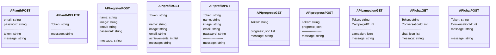

```mermaid

classDiagram
    class API auth POST{
        email: string
        password: string
        -------------------
        token: string
        message: string
    }

    class API auth DELETE{
        Token: string
        -------------------
        message: string
    }

    class API register POST{
        name: string
        image: string
        email: string
        password: string
        -------------------
        message: string
    }

    class API profile GET{
        Token: string
        -------------------
        name: string
        image: string
        email: string
        achievements: int list
        message: string
    }

    class API profile PUT{
        Token: string
        name: string
        image: string
        email: string
        password: string
        -------------------
        message: string
    }

    class API progress GET{
        Token: string
        -------------------
        progress: json list
        message: string
    }

    class API progress POST{
        Token: string
        progress: json
        -------------------
        message: string
    }

    class API campaign GET{
        Token: string
        CampaignID: int
        -------------------
        campaign: json
        message: string
    }

    class API chat GET{
        Token: string
        ConversationId: int
        -------------------
        chat: json list
        message: string
    }

    class API chat POST{
        Token: string
        ConversationId: int
        message: string
        -------------------
        message: string
    }

    

```