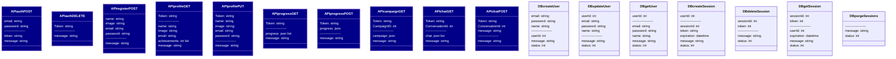

```mermaid

classDiagram
    class API auth POST{
        email: string
        password: string
        -------------------
        token: string
        message: string
    }

    class API auth DELETE{
        Token: string
        -------------------
        message: string
    }

    class API register POST{
        name: string
        image: string
        email: string
        password: string
        -------------------
        message: string
    }

    class API profile GET{
        Token: string
        -------------------
        name: string
        image: string
        email: string
        achievements: int list
        message: string
    }

    class API profile PUT{
        Token: string
        name: string
        image: string
        email: string
        password: string
        -------------------
        message: string
    }

    class API progress GET{
        Token: string
        -------------------
        progress: json list
        message: string
    }

    class API progress POST{
        Token: string
        progress: json
        -------------------
        message: string
    }

    class API campaign GET{
        Token: string
        CampaignID: int
        -------------------
        campaign: json
        message: string
    }

    class API chat GET{
        Token: string
        ConversationId: int
        -------------------
        chat: json list
        message: string
    }

    class API chat POST{
        Token: string
        ConversationId: int
        message: string
        -------------------
        message: string
    }

    style APIauthPOST fill:#008,color:#FFF
    style APIauthDELETE fill:#008,color:#FFF
    style APIregisterPOST fill:#008,color:#FFF
    style APIprofileGET fill:#008,color:#FFF
    style APIprofilePUT fill:#008,color:#FFF
    style APIprogressGET fill:#008,color:#FFF
    style APIprogressPOST fill:#008,color:#FFF
    style APIcampaignGET fill:#008,color:#FFF
    style APIchatGET fill:#008,color:#FFF
    style APIchatPOST fill:#008,color:#FFF

    class DB createUser{
        email: string
        password: string
        name: string
        -------------------
        userId: int
        message: string
        status: int
    }

    class DB updateUser{
        userId: int
        email: string
        password: string
        name: string
        -------------------
        message: string
        status: int
    }

    class DB getUser{
        userId: int
        -------------------
        email: string
        password: string
        name: string
        message: string
        status: int
    }

    class DB createSession{
        userId: int
        -------------------
        sessionId: int
        token: string
        expiration: datetime
        message: string
        status: int
    }

    class DB deleteSession{
        sessionId: int
        token: int
        -------------------
        message: string
        status: int
    }

    class DB getSession{
        sessionId: int
        token: int
        -------------------
        userId: int
        expiration: datetime
        message: string
        status: int
    }

    class DB purgeSessions{
        -------------------
        message: string
        status: int
    }

    

```