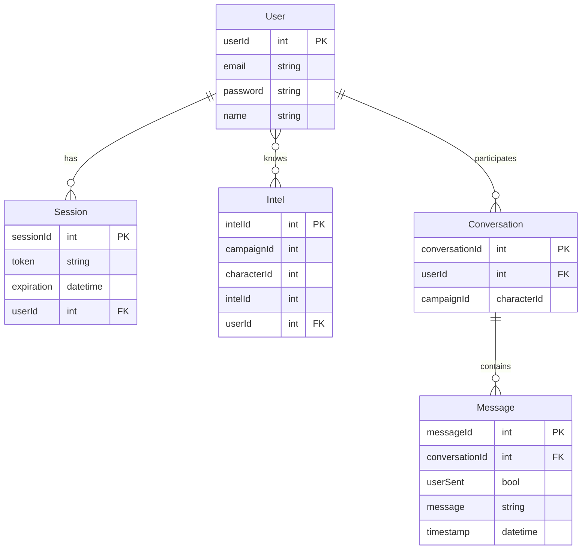

```mermaid
erDiagram
    User {
        userId int PK
        email string
        password string
        name string
    }
    Session {
        sessionId int PK
        token string
        expiration datetime
        userId int FK
    }
    Intel {
        intelId int PK
        campaignId int
        characterId int
        intelId int
        userId int FK
    }
    Conversation {
        conversationId int PK
        userId int FK
        campaignId
        characterId
    }
    Message {
        messageId int PK
        conversationId int FK
        userSent bool
        message string
        timestamp datetime
    }

    User ||--o{ Session : "has"
    User }o--o{ Intel : "knows"
    User ||--o{ Conversation : "participates"
    Conversation ||--o{ Message : "contains"
```