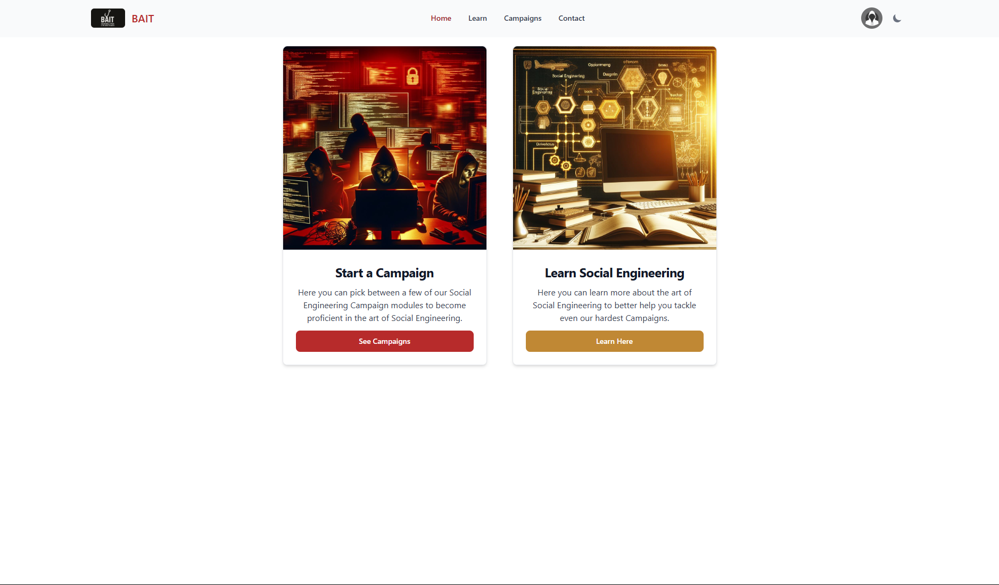

# SEPPTIC

The Social Engineering Practice Platform for Teaching Information Compromise

## Documentation

### Using Sepptic
- [Project Overview](Docs/Final%20Design%20Package/Overview.md)
- [Deployment Instructions](Docs/Final%20Design%20Package/Deployment%20Instructions.md)
- [Campaign Creation Instructions](Docs/Final%20Design%20Package/Campaign%20Creation%20Instructions.md)

### Development
- [Architecture](Docs/Final%20Design%20Package/Architecture.md)
- [File Structure](Docs/Final%20Design%20Package/FileStructure.md)
- [API Endpoints](Docs/Final%20Design%20Package/API%20Endpoints.md)
- [Database Schema](Docs/Final%20Design%20Package/ERD.md)

### Design and Feedback
- [Design Requirements](Docs/Final%20Design%20Package/Design%20Requirements.md)
- [User Feedback](Docs/Final%20Design%20Package/User%20Feedback.md)
- [Potential Improvements](Docs/Final%20Design%20Package/Potential%20Improvements.md)

## What is SEPPTIC?

SEPPTIC is an AI-powered platform for teaching social engineering in a safe and ethical way. It includes a learn section where users can learn about various social engineering tactics, and a campaigns section where users can practice what they learned with AI-powered characters in a simulated realistic environment.

SEPPTIC was created as a Capstone project for Brigham Young University's Cybersecurity program. Team members (from left to right): Ethan Beere, Garrett White, Elliot Delay, Matthew Taylor, Tyler Holland, Zac Hansen, and Nicholas Hague. Coached by Dr. Ben Schooley.