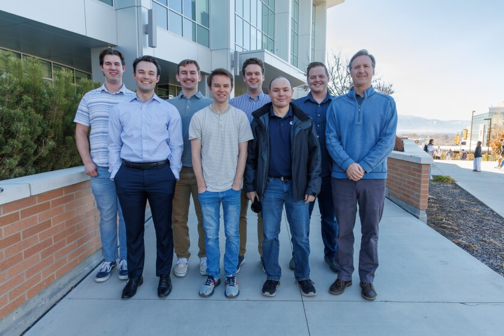

# SEPPTIC

The Social Engineering Practice Platform for Teaching Information Compromise

## What is SEPPTIC?

SEPPTIC is an AI-powered platform for teaching social engineering in a safe and ethical way. It includes a learn section where users can learn about various social engineering tactics, and a campaigns section where users can practice what they learned with AI-powered characters in a simulated realistic environment.

SEPPTIC was created as a Capstone project for Brigham Young University's Cybersecurity program. Team members (from left to right): Ethan Beere, Garrett White, Elliot Delay, Matthew Taylor, Tyler Holland, Zac Hansen, Nicholas Hague, and Dr. Ben Schooley.

## Documentation

- [Project Overview](Docs/Final%20Design%20Package/Overview.md)